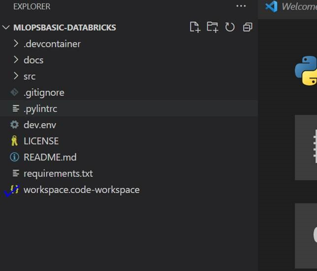

# Solution Setup guide


## Prerequisite

>1. Active Azure Subscription
>2. Azure Service Principal (valid Client ID and secret ) which has the contributor permission the subscription. We are going to create the resource group using the service principal.

## Section 1: Docker Image Load in VS Code

1.	Clone the Repository : https://DAISolutions@dev.azure.com/DAISolutions/MLOperationalization/_git/MLOpsBasic-Databricks
2.	Install Docker Desktop as the solution is going to run on a docker image.
3.	Create .env file in the root folder, and do not copy any content.
4.	In the repo, open the workspace.



5.Select the prompt with Reopen in Container 


6. In the background, it is going to build a docker registry. We need to wait for sometime to complete the all the steps.
7. Once it is loaded. we will be able to see the below icon in the left bottom corner 


8.	You will be prompted with installing the required extension on the right bottom corner. Install it.


9.	The python extension should be shown as below 


## Section 2: Data bricks Environment creation

This  demo basically creates a new Databricks workspace and cluster. If you would like to reuse the existing workspace and cluster, You can skip this section
 
1. Go to src/setup/config/setup_config.json, and complete the json files with the values; according to your environment 
```
{
 
    "applicationID":"deeadfb5-27xxxaad3-9fd39049b450",
    "tenantID":"72f988bf-8xxxxx2d7cd011db47",
    "subscriptionID":"89c37dd8xxxx-1cfb98c0262e",
    "resourceGroupName":"AccleratorDBKMLOps2",
    "resourceGroupLocation":"NorthEurope"
}
```
 
2. create the file and provide the client ID secret in this file : src/vault/appsecret.txt  [Do it from the Local file system, not from the docker]
3. Open the Powershell ISE in your local machine, as we are going to run couple of powershell scripts.
4.set the root path of the Powershell terminal till setup, and execute the deployResource.ps1
 ```
cd "C:\Users\sapa\OneDrive - Microsoft\Documents\projects\New folder\MLOpsBasic-Databricks\src\setup"
.\deployResources.ps1
 ```
>a.	If you receive the below error, execute the  command [
Set-ExecutionPolicy RemoteSigned]

```
.\deployResources.ps1 : File C:\Users\sapa\OneDrive - Microsoft\Documents\projects\New 
folder\MLOpsBasic-Databricks\src\setup\deployResources.ps1 cannot be loaded because running scripts is disabled on this.
```


## Section 3: Databricks Cluster Creation

1.	To create the databricks cluster we need to have personal Access token created. Go to the Databricks workspace, and get the personal access token from the user setting, and save it in the file src/vault/DBKtoken.txt
2.	Run the following command
 
 ```
cd "C:\Users\sapa\OneDrive - Microsoft\Documents\projects\New folder\MLOpsBasic-Databricks\src\setup"
 
.\configureResources.ps1
 ```
3.	Copy the output of the script and paste it to the .env file which you have created previously 

## Section 4: Create the .env file


1.	We need to manually change the databricks host and appI_IK values. Other values should be as is from the output from the previous script.
APPI_K = connection string of the application insight
 
 ```
 
PYTHONPATH=/workspaces/MLOpsBasic-Databricks/src/modules
APPI_IK=InstrumentationKey=e6221ea6-a3b9-4739-918f-8a0985a1502f;IngestionEndpoint=https://northeurope-2.in.applicationinsights.azure.com/
DATABRICKS_HOST=https://adb-7936878321001673.13.azuredatabricks.net
DATABRICKS_TOKEN= <Provide the secret>
DATABRICKS_ORDGID=7936878321001673
```

## Section 5: Configure the databricks connect

1.	In this step we are going to configure the databricks connect , so that the VS code can connect to the databricks. Run the below command for that from the docker terminal.

 ```
python "src/tutorial/scripts/local_config.py" -c "src/tutorial/cluster_config.json"
 ```
>Note: If you get any error saying that "model not found". Try to reload the VS code window and see if you are getting prompt  right bottom corner saying that configuration file changes, rebuild the docker image. Rebuild it and then reload the window. Post that you would not be getting any error. 
 
#### Verify :
1.	You will be able to see the message All tests passed.


## Section 6:  Create the private package(.whl) and upload to the workspace.
1.	Run the below command:
python src/tutorial/scripts/install_dbkframework.py -c "src/tutorial/cluster_config.json"
 
Post  Execution of the script, we will be able to see the module to be installed.


## Section 7: Using the framework.
 
To check if the framework is working fine or not, lets execute this file : **src/tutorial/remote_analysis.py**
Post running the script, we will be able to see the data in the terminal 

